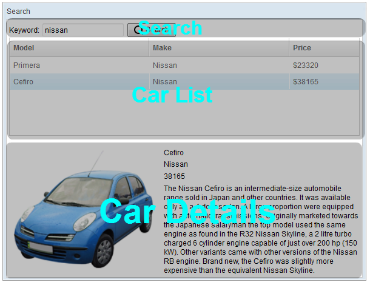

# ZK Framework with MVC pattern

Di project ini kita akan membuat sebuah web aplikasi dengan framework ZK 
menggunakan pendekatan MVC (Model View Controller) dengan contoh kasus 
menampilkan data ke tableview dan pencariannya. kurang lebih seperti gambar berikut:



Pada dasarnya, tampilan tersebut terbagi menjadi 3 area yaitu 
- pencarian, 
- daftar semua mobil dan 
- detail mengenai mobil-mobil yang di seleksi di table.

### Membuat project dengan maven archetype zk-archetype-webapp

```bash
mvn archetype:generate -Dpackage=belajar.zk -DgroupId=com.dimas.maryanto.zk -DartifactId=zk.web-mvc -Dversion=1.0-SNAPSHOT -DarchetypeGroupId=org.zkoss -DarchetypeArtifactId=zk-archetype-webapp
```

Tambahkan dependency `org.projectlombok` untuk memudahkan dalam membuat POJO (Plain Old Java Object)

```xml
<dependency>
    <groupId>org.projectlombok</groupId>
    <artifactId>lombok</artifactId>
    <version>1.16.18</version>
</dependency>
```